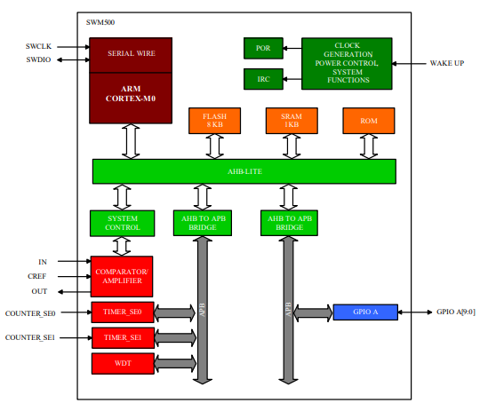

# [SWM050](https://github.com/SoCXin/SWM050)

#### [Synwit](http://www.synwit.cn)：[Cortex M0](https://github.com/SoCXin/CM0)
#### [Level](https://github.com/SoCXin/Level)：50 MHz

### [简介](https://github.com/SoCXin/SWM050/wiki)

[SWM050](https://github.com/SoCXin/SWM050) 是一款基于 Cortex-M0 的 32 位微控制器。与传统 8051 单片机相比，在价格相近的情况下，保证了高性能、低功耗、代码密度大等优势，适用于工业控制及白色家电等诸多应用领域。

SWM050 内嵌 ARM® Cortex-M0 控制器，最高可运行至 50Mhz，内置 8K 字节程序FLASH 存储器，1K 字节 SRAM，0.5K 字节数据 FLASH 存储器。提供 18MHz/36MHz 精度为 1%的内置时钟，支持加密及 IAP（在应用编程）操作。外设包括看门狗定时器，2 组专用定时器（包含定时、捕捉、PWM 等功能）。

#### 关键特性

* 50MHz高主频
* 小封装 TSSOP8/SSOP16

### [资源收录](https://github.com/SoCXin/SWM050)

* [参考文档](docs/)
* [参考资源](src/)
* [参考工程](project/)

### [选型建议](https://github.com/SoCXin)

[SWM050](https://github.com/SoCXin/SWM050)

###  [芯云 www.SoC.Xin](http://www.SoC.Xin)

