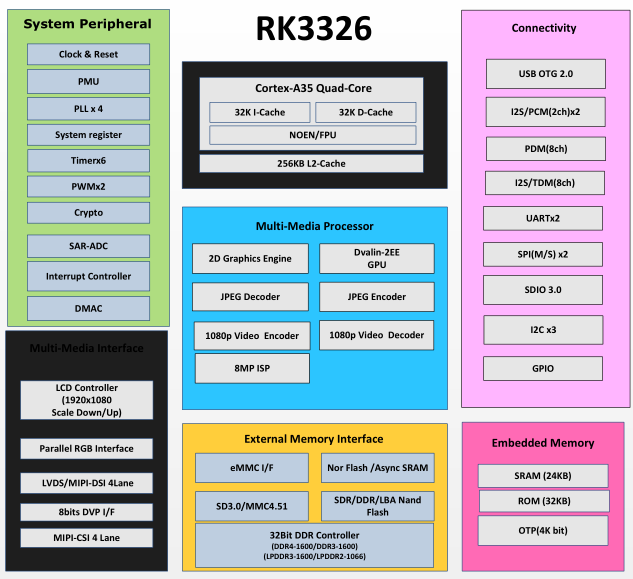

# [RK3326](https://github.com/mcuyun/RK3326) 

 

#### [Vendor](https://github.com/sochub/Vendor)：[rock-chips](https://github.com/sochub/rockchips)
#### [cortex](https://github.com/sochub/cortex)：[A35](https://github.com/sochub/CA35)
#### [Level](https://github.com/sochub/Level)：

## [芯片描述](https://github.com/sochub/RK3326/wiki) 

## [简介](https://github.com/mcuyun/RK3326/wiki)

瑞芯微智联 4核 A35 with 1.5GHz

主要特点：集成8M ISP

功能特点：Mali-G31MP2

主要短板：单USB 2.0 OTG，无HDMI

封装：TFBGA395L (14mm x 14mm; ball: 0.3mm pitch 0.65mm)

### [资源收录](https://github.com/sochub/RK3326)

* [文档](docs/) 
* [linux系统](linux/)

### [选型建议](https://github.com/sochub)

[RK3326](https://github.com/sochub/RK3326)入门级高性价比产品

###  [SoC资源平台](http://www.qitas.cn)   
